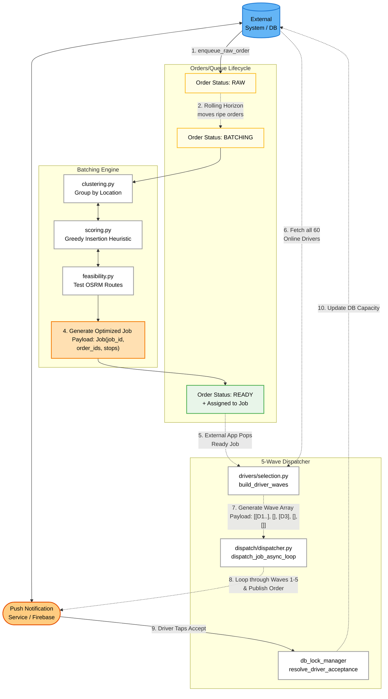

# Detailed System Architecture Schematic

Here is a highly structural, colored Mermaid diagram replicating the layout logic from your visual schema. It maps the full lifecycle: Order Arrival `->` Batching `->` Ready Jobs `->` Driver Selection `->` Publishing to Smartphone!

