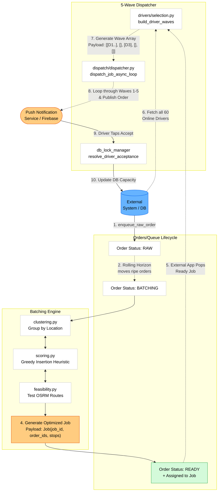

# System Architecture Visual Flow

This document contains the visual Mermaid representation of the PASSL system architecture, matching the structure of the data flow and system components.

```mermaid
graph TD
    classDef whiteBox fill:#ffffff,stroke:#cccccc,stroke-width:1px,color:#000
    classDef blueCyl fill:#66b3ff,stroke:#005ce6,stroke-width:1px,color:#000
    classDef orangeOval fill:#ffcc80,stroke:#e65100,stroke-width:1px,rx:20,ry:20,color:#000
    classDef orangeBox fill:#ffcc80,stroke:#e65100,stroke-width:1px,color:#000
    classDef greenBox fill:#d4fada,stroke:#28a745,stroke-width:1px,color:#000

    subgraph S_Disp["5-Wave Dispatcher"]
        SEL["drivers/selection.py<br/>build_driver_waves"]
        DISP["dispatch/dispatcher.py<br/>dispatch_job_async_loop"]
        LOCK["db_lock_manager<br/>resolve_driver_acceptance"]
    end

    PUSH(["Push Notification<br/>Service / Firebase"])
    DB[("External<br/>System / DB")]

    subgraph S_Bat["Batching Engine"]
        CLUST["clustering.py<br/>Group by Location"]
        SCORE["scoring.py<br/>Greedy Insertion Heuristic"]
        FEAS["feasibility.py<br/>Test OSRM Routes"]
        GEN["4. Generate Optimized Job<br/>Payload: Job(job_id, order_ids, stops)"]
    end

    subgraph S_Ord["Orders/Queue Lifecycle"]
        RAW["Order Status: RAW"]
        BATCH["Order Status: BATCHING"]
        READY["Order Status: READY<br/>+ Assigned to Job"]
    end

    SEL -.->|"7. Generate Wave Array<br/>Payload: [[D1..], [], [D3], [], []]"| DISP
    DISP -.->|"8. Loop through Waves 1-5<br/>& Publish Order"| PUSH
    PUSH -->|"9. Driver Taps Accept"| LOCK
    LOCK -->|"10. Update DB Capacity"| DB
    
    DB -.->|"6. Fetch all 60<br/>Online Drivers"| SEL
    DB -->|"1. enqueue_raw_order"| RAW
    
    RAW -.->|"2. Rolling Horizon<br/>moves ripe orders"| BATCH
    BATCH --> CLUST
    
    CLUST <--> SCORE
    SCORE <--> FEAS
    FEAS --> GEN
    
    GEN --> READY

    READY -.->|"5. External App Pops<br/>Ready Job"| SEL

    class SEL,DISP,LOCK,CLUST,SCORE,FEAS,RAW,BATCH whiteBox
    class DB blueCyl
    class PUSH orangeOval
    class GEN orangeBox
    class READY greenBox
    style S_Disp fill:#ffffe0,stroke:#e6e600,stroke-width:1px,color:#000
    style S_Bat fill:#ffffe0,stroke:#e6e600,stroke-width:1px,color:#000
    style S_Ord fill:#ffffe0,stroke:#e6e600,stroke-width:1px,color:#000
```
